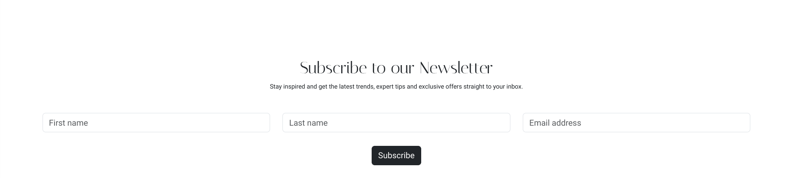
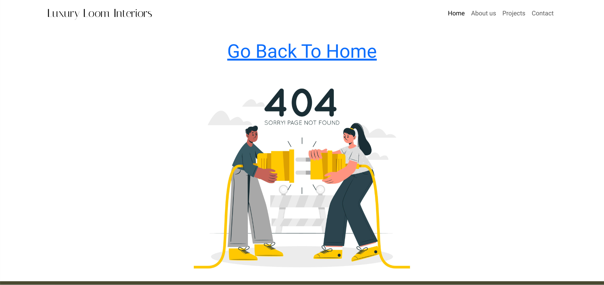
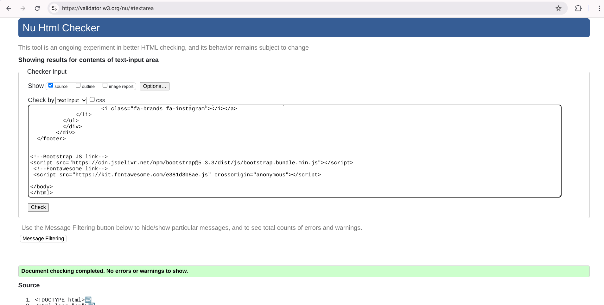

# Luxury Loom Interiors

(Developer: Mariama Kamara)

## Table of Contents
1. [Project Goals](#project-goals) 
- [User Goals](#user-goals)
- [Site Owner Goals](#site-owner-goals) 
2. [User Experience](#user-experience) 
- [Target Audience](#target-audience) 
- [User Requirments and Expectations](#user-requirments-and-expectations)
- [User Stories](#user-stories)
3. [Design](#design)
- [Design Choices](#design-choices)
- [Colours](#colours) 
- [Fonts](#fonts) 
- [Structure](#structure) 
- [Wireframes](#wireframes) 
4. [Technologies Used](#technologies-used) 
- [Languages](#languages)
- [Frameworks and Tools](#frameworks--tools)
5. [Features](#features)
6. [Testing](#testing)
- [HTML Validation](#html-validation)
- [CSS Validation](#css-validation)
- [Accessibility](#accessibility)
- [Performance](#performance) 
- [Device Testing](#device-testing) 
- [Browser Compatibility](#browser-compatibility) 
- [Testing User Stories](#testing-user-stories)
7. [Bugs](#bugs)
8. [Deployment](#deployment)
9. [Credits](#credits) 
10. [Acknowledgments](#acknowledgements) 

### Project Goals

#### User Goals
- Finding out what the company has to offer.
- See projects that the company have done.
- Find information about the company. 
-  Find the location of the buisness.

#### Site Owner Goals
- Increase client enquiries.
- Promote the business. 
- Showcase the companys expertise. 
- Provide luxury experience.
- Provide a way for new clients and exsisting clidents to contact the business.
- Provide infotamtion about the buisness to clients.

### User Experience

#### Target Audience
- People looking for a interior deisgn company to elevate there space i.e home, office.
- Investors aiming to add value to properties through luxury interior design.

#### User Requirments and Expectations
- A simple navigation system 
- High quality protraying the buisness
- Visually appealing design regargless of the screensize
- Easy contact options
- Accessibility

#### User Stories:

#### First-time User 
1. As a first time user, I want to know where the business is located i.e country & city. 
2. As a first time user, I want to know what services the business has to offer.
3. As a first time user, I want to get a feel of business will elevate my space. 
4. As a first time user, I want to know how best to contact the company.
5. As a first time user, I want a clear explanation that the page I'm looking for cannot be found.

#### Returning User
6. As a returning user, I want to see the companys latest project.
7. As a returning user, I want to know if there is a new service.
8. As a returning user, I want to know if there is any new offers.
9. As a returning user, I want to know if the contact details are the same or have changed.
10. As a returning user, I want to know who founded the company. 
11. As a returning user, I want to get directions to the companys showroom studio 
12. As a returning user, I want the 404 page to include a quick way to navigate to the pages on the website. 

#### Site Owner
13. As the site owner, I want users to find news about offers, latest trends and expert tips.
14. As the site owner, I want users to get to know the business and how it evolved.
15. As the site owner, I want users to be able to contact us via a form,email, telephone or our showcase studio location.

### Design
#### Design Choices:
The webpage was designed for a luxury, mordern and minimalist approach to the customer. It is clear and sleek and gives the customer a insight of a highly professional and seamless experience they will get if they work with the business.

#### Colours:
For the colour scheme neutral tones were chosen to match the images on the page. I chose the colours by inserting the images used in my project to the [Image Color Picker](https://imagecolorpicker.com/) website and searched for there HEX Code. The two colours I chose are #e9eceb for the body and #494931; for the footer.

#### Fonts:
The two main fonts are Gilda display which is the primary font with a fallback of sans-serif and Italiana which is the secondary font with a fall back of sans-serif.

#### Structure:
The page is structured in a easy, user friendly way. When the customers arrive on the website they are immediately welcomed with a logo of the left side and a familiar type of navigation bar to the right. The website consists of five pages:
1. A homepage with a section to subscribe to the newsletter
2. A about us page with a descriptive insight of what the company is about and what it has to offer and a image of the founder and co founder
3. A project page presenting the projects carried out by the company demonstrating to the customer their expertise and commitment to excellence
4. A contact page with a image of the company's interior design work, a contact form, a address and contact number and a google map so customers can find the showcase studio

#### Wireframes

Home

About us

Projects

Contact us

### Technologies Used
#### Languages 
- HTML
- CSS

#### Frameworks & Tools
- Bootstrap v5.05
- Git 
- GitHub
- Gitpod
- Gidpod
- Balsamiq
- Google Fonts
- Image Color Picker 
- Font Awesome
- Pexels
- Unsplash
- Favicon.io

### Features
The page consists of four pages and nine features. 

Logo and Navigation Bar

- Featured on all four pages 
- The navbar is responsive and changes to a toggler on smaller screens (320px and up and 576px and up to 992px), it includes link to the Homepage, About us page, Projects page and Contact us page
- It allows users to easily navigate the page 
 
 

Carousel

 

 - Presents to the user of the companys expertise showcasing its previous interior design work
 - Gives optioss for the user to navigate the slideshow back and fourth via the arrows
 - User stories covered: 3

Subscription form

- Allows customers to sign up to the newsletter to for latest updates and deals
- User stories covered: 7, 8 and 13

 
  

Footer

 - Featured on all four pages 
 - Consits of four social media links (Facebook, Twitter, Youtube and Instagram)

About us

 
 - Gives a detail description of what 'Luxury Loom Interiors' company has to offer 
 - Includes two images of the founder and co founder of the company
 - User stories covered: 2, 3, 14 

Projects

- Presents to the user the project outcomes that the company have done for its clients within the United Kingdom with a small description of the location of each project
- User stories covered: 3, 6, 

Contact Form

- A way for the user to send written enquiries to the company
- User stories covered: 4 and 15

Map

- Shows the precise location of the showcase studio
- User stories covered: 11 and 15

Info section

- Provides the user with a phone number, email and address
- User stories covered: 1, 4, 9, 15

404 page

- Provides a clear and visible message that the page is not found
- Use stories covered: 12

### Testing
#### HTML Validation
- The W3S Markup Validation Service was used to validate the HTML of the website

Home page
Fixed:

About us page
Fixed:

Project page
Fixed:

Contact page
Fixed:

404 page
Fixed:

#### CSS Validation
- The W3C CSS Validator was used to validate the the CSS of the website.

CSS

#### Accessibility
- The WAVE WebAIM web accessibility evaluation tool was used to ensure the website fulfillled high accessibility. Across all pages it passed with ..

i) Home page

ii) About us page 

iii) Projects page 

iv) Contact us page

#### Performance 

Home page

About us page

Project page

Contact us page 

### Device testing
#### Device compatibility
The website was tested on the following devices:
- Chromebook Plus 14a
- Iphone 12pro Max 
- Iphone 15
#### Browser compatibility
The website was tested on the following browsers:
- Google Chrome
- Microsoft Edge 

#### Testing user stories

### Bugs

### Deployment
 The website was deployed using GitHub Pages by following these steps:

 1. In the GitHub repository select the 'Settings' tab
 2. On the left side select 'Pages'
 3. Under 'Build and deployment (source)' select the drop down box then select 'Deploy from a branch'
 3. Under 'Branch' select 'main' beside 'main' you will see a folder icon select it and then select '/root'
 4. After the webpage automatically refreshes, you'll see at the top 'Your site is life at https://kmarik.github.io/luxury-loom-interiors/

 You can for fork the repository by following these steps:
1. Go to the GitHub repository
2. Click on Fork button in upper right hand corner

You can clone the repository by following these steps:
1. Go to the GitHub repository 
2. Locate the Code button above the list of files and click it 
3. Select if you prefere to clone using HTTPS, SSH, or Github CLI and click the copy button to copy the URL to your clipboard
4. Open Git Bash
5. Change the current working directory to the one where you want the cloned directory
6. Type git clone and paste the URL from the clipboard ($ git clone https://github.com/YOUR-USERNAME/YOUR-REPOSITORY)
7.Press Enter to create your local clone.

 You can clone the repository via Github desktop by following these steps: 

1. Go to the Github repository
Select the '<> Code' drop down button then copy the URL
2. Select 'File' on the desktop then select 'Clone repository'
3. Click 'URL' and paste the URL
4. Then select 'Clone'

Go to the Github repository
2. Select the '<> Code' drop down button
3. Select if you prefer to clone using HTTPS, SSH or GitHub CLI then copy the URL to your clipboard
4. Open Git Bash 
5. 

### Credits 
#### Media 
In order of appearance:
- Carousel images 1, 2 and 4: Photo by Spacejoy on [Unsplash](https://unsplash.com/@spacejoy)
- Carousel image 3: by Medhat Ayad on [Pexels](https://www.pexels.com/photo/3d-model-3ds-max-arcviz-bath-towels-543798/)
- Founder image: by Emmy E [Pexels](https://www.pexels.com/photo/woman-wearing-gray-notch-lapel-suit-jacket-2381069/)
- Co founder image: by Alina Matveycheva [Pexels](https://www.pexels.com/photo/woman-standing-in-white-suit-jacket-25985701/)
- Project images: by Spacejoy on [Unsplash](https://unsplash.com/@spacejoy) 
- Contact us image: by Wilcle Nunes on [Pexels](https://www.pexels.com/photo/decor-in-luxurious-apartment-27059631/)
- 404 error image: on Freepik [Freepik](https://www.freepik.com/free-vector/error-404-concept-landing-page_8794579.htm#fromView=keyword&page=1&position=38&uuid=2e18e1a6-3a97-492a-8ee2-60789fc2387d)

#### Code
In order of appearance 
- The HTML 

### Acknowledgements
I would like to take the opportunity to thank: 

- My mentor Mo Shami, for his support and guidance during the project insuring I meet the deadline successfully. 
- To my newfound virtual friends on the Code Insitute Slack for their support and help. 

